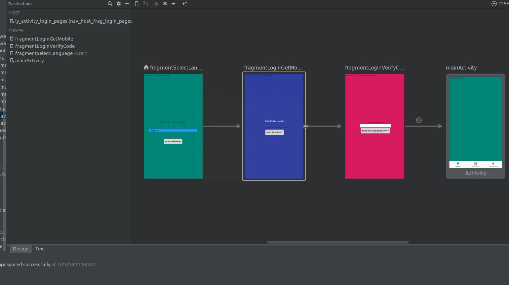
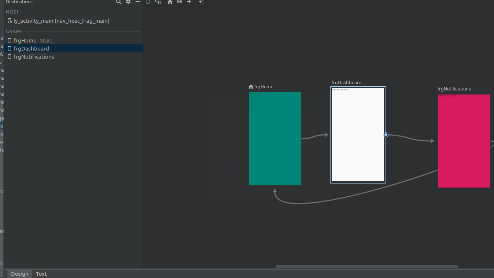
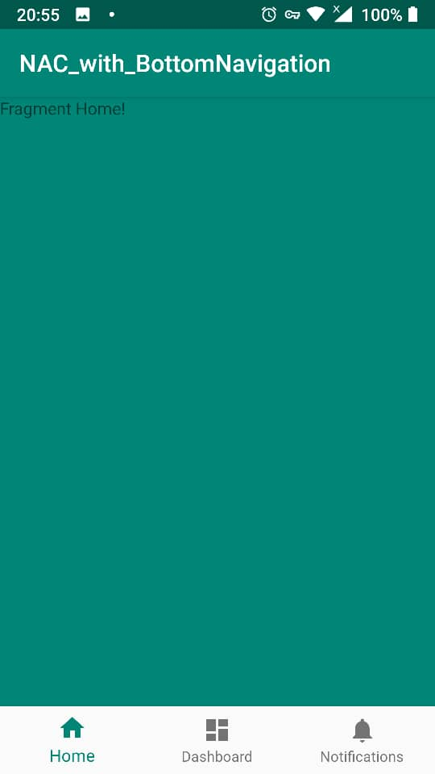
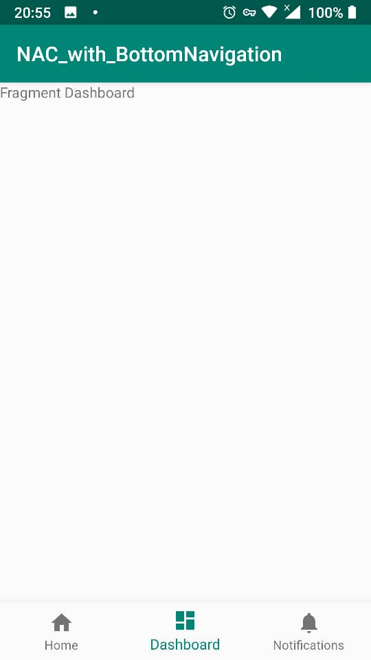

# Android Navigation Architecture Component with BottomNavigation with Kotlin
To show how to use multiple activities each contains navigation graph (fragments)
also connect Navigation graph to Bottom navigation .

#Back stack handling will add soon.

## Screenshots:

<b> Navigation Graph 1 (Activity 1: Login Pages [contains 3 fragments] ): </b>

      

<b> Navigation Graph 2 (Activity 2: main pages connected to bottomNavigations [contains 3 fragments] ): </b>

 

     

<b> Main Page Activity that contain Navigation Graph2 (Fragment 1): </b>

 

     

<b> Main Page (Fragment 2): </b>

 

     

